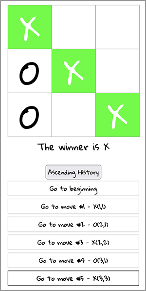

# Tic Tac Toe Game
A project following the official Reactjs.org ["Tutorial: Intro to React"](https://reactjs.org/tutorial/tutorial.html)

## Technologies
React

## Features
In addition to following the tutorial, I also:
- Did the separate bonus features in the tutorial on my own:
    - "Display the location for each move in the format (col,row) in the move history list"
    - "Bold the currently selected item in the move list"
    - "Add a toggle button that lets you sort the moves in either ascending or descending order."
    - "When someone wins, highlight the three squares that caused the win."
	- "When no one wins, display a message about the result being a draw."
- Made custom styles and made the game mobile friendly.

## Screenshot

## Working Demo
[Click here to see a working demo](https://buckleupstudios.com/resources/react/tictactoe/)
